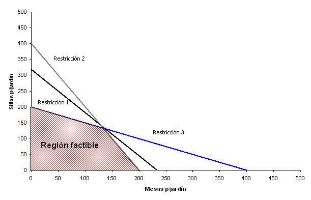

## Página de programación lineal

En esta página voy a mostrar las cosas magníficas que estoy aprendiendo en el
magnífico curso de Programación lineal.

### Sympy

Aprendimos a usar la biblioteca sympy.

### Enlaces

- [Página de Python](https://www.python.org/)
- [Página de Google](https://www.google.com/)
- [Github](https://www.github.com/)

## Problemas

Maximizar $$z=x_1+x_2$$ sujeto a

$$x_1\geq 0.$$

Consideremos \(x^2+y^2\) y

\begin{equation}
a+b
\end{equation}
